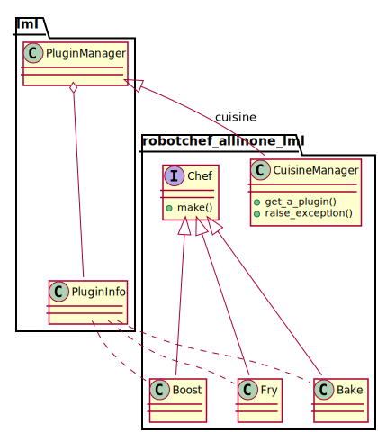

Robot Chef all in one package with lml
================================================================================

Now let us bring in lml and see see how the lml package can be used
to rewrite **Robot Chef** but in a single package. This chapter introduces
two classes: :class:`lml.plugin.PluginManager` and :class:`lml.plugin.PluginInfo`.
And show how those classes can be used to make factory pattern.
Meanwhile, it demonstrates that the lml based plugins can be made to load
immediately and in a single package. And this sections helps you to understand
the next section where we will make the plugins to be loaded later.

Demo
--------------------------------------------------------------------------------

Please navigate to
`lml/examples <https://github.com/chfw/lml/tree/master/examples>`_,
you would find robotchef_allinone_lml and its packages. Do the following::

    $ cd robotchef_allinone_lml
    $ python setup.py install

And then you could try::

    $ robotchef_allinone_lml "Fish and Chips"
    I can fry Fish and Chips
	
Lml plugins and plugin manager
-------------------------------

.. _cuisine_manager:

plugin.py
++++++++++

`CuisineManager` inherits from :class:`~lml.plugin.PluginManager` class and
replaces the static registry `PLUGINS` and the modular function `get_a_plugin`.
Please note that `CuisineManager` declares that it is a manager for plugin_type named
**cuisine**. 

.. literalinclude:: ../../examples/robotchef_allinone_lml/robotchef_allinone_lml/plugin.py
   :language: python
   :lines: 8-17

Next, the :class:`~lml.plugin.PluginInfo` decorates all Chef's subclasses as
**cuisine** plugins and register the decorated classes with the manager class
for **cuisine**, `CuisineManager`. The food names become the tags which will
be used to look up the classes.

.. literalinclude:: ../../examples/robotchef_allinone_lml/robotchef_allinone_lml/plugin.py
   :language: python
   :lines: 1, 18-

Here is the :ref:`rb3-diff-rb0-plugin`.  

main.py
+++++++++

The main code has been updated to reflect the changes in plugin.py. `CuisineManager`
has to be instantiated to be the a factory manager.

.. literalinclude:: ../../examples/robotchef_allinone_lml/robotchef_allinone_lml/main.py
   :diff: ../../examples/robotchef_allinone/robotchef_allinone/main.py

Remember this interaction::

    $ robotchef "Portable Battery"
    I can cook Portable Battery for robots

The response comes from class `Boost`. It is obtained via CuisineManager when user types
'Portable Battery'. And the food parameter was passed to the instance of Boost.
`make` method was called and it prints 'I can cook Portable Battery for robots'.

See also
-------------

#. pyexcel-chart: `use lml to refactor existing plugins <https://github.com/pyexcel/pyexcel-chart/commit/ca307f49b10f00cd080a3321490acc7b89ca0a41>`_

