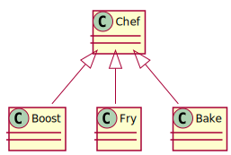

Robot Chef all in one package without lml
================================================================================

In this chapter, we are going to see how **Robot Chef** could be implemented
without lml. In later on chapters, we will bring in **lml** step by step.

Demo
--------------------------------------------------------------------------------

Please checkout lml::

    $ git clone https://github.com/chfw/lml.git

And navigate to `lml/examples <https://github.com/chfw/lml/tree/master/examples>`_,
you would find robotchef_allinone and its packages. Do the following::

    $ cd robotchef_allinone
    $ python setup.py install

And then you could try::

    $ robotchef_allinone "Fish and Chips"
    I can fry Fish and Chips

Conventional plugin and plugin factory
---------------------------------------

plugin.py
+++++++++++

`Chef` is the plugin interface that makes food. Boost, Bake and Fry are the
actual implementations. Boost are for "robots". Bake and Fry are for human.

.. note::

   The plugin interface is your responsibility. **lml** gives the freedom to you.

.. literalinclude:: ../../examples/robotchef_allinone/robotchef_allinone/plugin.py
  :language: python
  :lines: 5-26

Line 13, class `Chef` defines the plugin class interface. For robotchef, `make` is
defined to illustrate the functionality. Naturally you will be deciding the
interface for your plugins.

Some of you might suggest that class `Chef` is unnecessary because
Python uses duck-typing, meaning as long as the plugin has `make` method,
it should work. Yes, it would work but it is a short term solution.
Look at the long term, you could pass on additional functionalities
through class `Chef` without touching the plugins. What's more, for
plugin developers, a clear defined interface is better than no class
at all. And I believe the functions of a real plugin are more than
just one here.

Next in the plugin.py file, PLUGINS is the dictionary that has food name as
key and Chef descendants as values. `get_a_plugin` method returns a Chef or
raises NoChefException.

.. literalinclude:: ../../examples/robotchef_allinone/robotchef_allinone/plugin.py
  :language: python
  :lines: 29-

main.py
+++++++++++

Let us glimpse through the main code:

.. literalinclude:: ../../examples/robotchef_allinone/robotchef_allinone/main.py
  :language: python

The code takes the first command option as food name and feeds it to the
factory method `get_a_plugin`, which returns a Chef to "make" the food.
If no chef was found, it prints the default string: I do not know.

That is all about the all in one **Robot Chef**.
