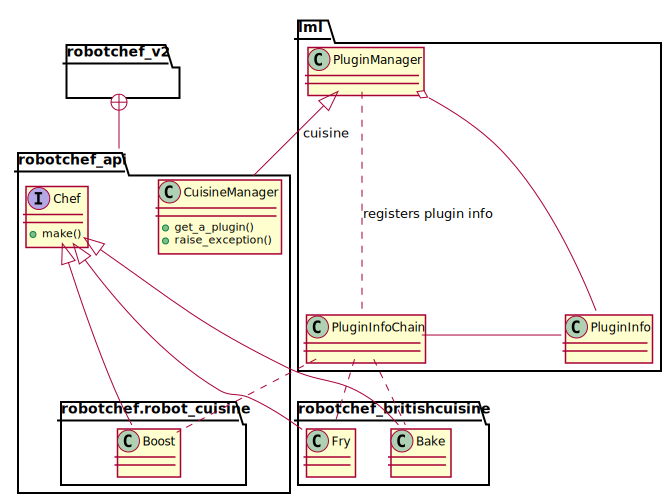

Robot Chef version 2: Use lml to write a shared library
================================================================================

In previous chapter, lml was used to split all in one Robot Chef into
one core package and several plugins module and packages. In this
chapter, we are going to go one step further to split the core package into
two so as to showcase how to use lml to write a shared api library.

Demo
--------------------------------------------------------------------------------

Navigate to `lml/examples/v2 <https://github.com/chfw/lml/tree/master/examples/v2>`_,
you would find robotchef and its packages. Do the following::

    $ virtualenv --no-site-packages robotchefv2
    $ source robotchefv2/bin/activate
    $ cd robotchef_v2
    $ python setup.py install
    $ cd robotchef_api
    $ python setup.py install

And then you can type in and test the second version of Robot Chef::

    $ robotchef_v2 "Portable Battery"
    I can cook Portable Battery for robots
    $ robotchef_v2 "Jacket Potato"
    I do not know how to cook Jacket Potato

In order to add "Jacket Potato" in the know-how, you would need to install
robotchef_britishcuisine in this folder::

    $ cd robotchef_britishcuisine
    $ python setup.py install
    $ robotchef_v2 "Jacket Potato"
    I can bake Jacket Potato

Robot Chef v2 code
-----------------------

Let us look at main code robotchef_v2:

.. literalinclude:: ../../examples/v2/robotchef_v2/robotchef_v2/main.py
  :diff: ../../examples/robotchef/robotchef/main.py

The code highlighted in red are removed from main.py and are placed into
**robotchef_api** package. And robotchef_v2 becomes the consumer of
the robotchef api.

And plugin.py and robot_cuisine has been moved to **robotchef_api** package.

Robot Chef API
--------------------

Now let us look at robotchef_api. In the following directory listing, the
plugin.py And robot_cuisine is exactly the same as the :ref:`plugin.py <plugin>`
and :ref:`robot_cuisine <builtin_plugin>` in robotchef::

    __init__.py    plugin.py       robot_cuisine

Notably, the plugin loader is put in the __init__.py:

.. literalinclude:: ../../examples/v2/robotchef_api/robotchef_api/__init__.py
  :language: python

scan_plugins here loads all modules that start with "robotchef_" and as well as
the module `robotchef_api.robot_cuisine` in the white_list.

This is how you will write the main component as a library.

Built-in plugin and Standalone plugin
--------------------------------------

You may have noticed that a copy of robotchef_britishcuisine is placed in v2 directory.
Why not using the same one above v2 directory? although they are almost identical,
there is a minor difference. robotchef_britishcuisine in v2 directory depends on
robotchef_api but the other British cuisine package depends on robotchef. Hence, if you
look at the fry.py in v2 directory, you will notice a slight difference:

.. literalinclude:: ../../examples/v2/robotchef_britishcuisine/robotchef_britishcuisine/fry.py
  :diff: ../../examples/robotchef_britishcuisine/robotchef_britishcuisine/fry.py
