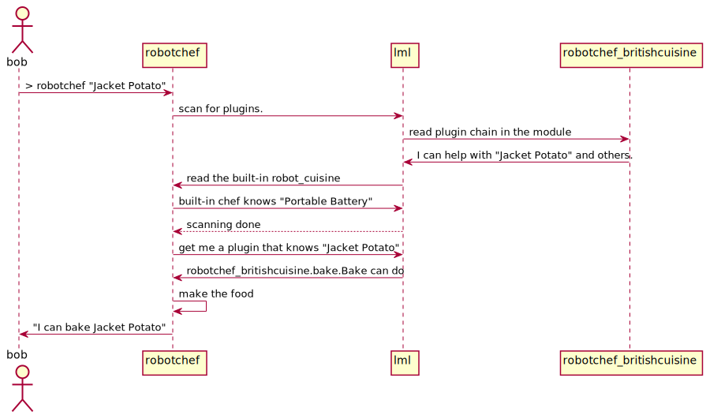

Logging facility
======================

During the development of lml package, the logging facility helps debugging a lot. Let
me show you how to enable the logs of lml.

Enable the logging
-------------------

Let us open robotchef's `main.py <https://github.com/chfw/lml/blob/master/examples/robotchef/robotchef/main.py>`_. Insert the highlighted codes.

.. code-block:: python
    :emphasize-lines: 5-10
   
    import sys
    
    from robotchef.plugin import CuisineManager, NoChefException
    
    import logging
    import logging.config
    
    logging.basicConfig(
        format='%(name)s:%(lineno)d - %(levelname)s - %(message)s',
        level=logging.DEBUG)
    
    
    def main():
        if len(sys.argv) < 2:
            sys.exit(-1)
    
        manager = CuisineManager()
    ...
    
Then you will need to run the installation again::

    $ cd robotchef
    $ python setup.py install

Let us run the command again::
   
   $ robotchef "Jacket Potato"
   lml.plugin:226 - DEBUG - declare 'cuisine' plugin manager
   lml.loader:52 - DEBUG - scanning for plugins...
   lml.utils:48 - DEBUG - found robotchef_allinone_lml
   lml.plugin.PluginInfoChain:139 - DEBUG - add robotchef_britishcuisine.fry.Fry as 'cuisine' plugin
   robotchef.plugin.CuisineManager:178 - DEBUG - load robotchef_britishcuisine.fry.Fry later
   lml.plugin.PluginInfoChain:139 - DEBUG - add robotchef_britishcuisine.bake.Bake as 'cuisine' plugin
   robotchef.plugin.CuisineManager:178 - DEBUG - load robotchef_britishcuisine.bake.Bake later
   lml.utils:48 - DEBUG - found robotchef_britishcuisine
   lml.plugin.PluginInfoChain:139 - DEBUG - add robotchef.robot_cuisine.electrify.Boost as 'cuisine' plugin
   robotchef.plugin.CuisineManager:178 - DEBUG - load robotchef.robot_cuisine.electrify.Boost later
   lml.utils:48 - DEBUG - found robotchef.robot_cuisine
   lml.loader:82 - DEBUG - scanning done
   robotchef.plugin.CuisineManager:160 - DEBUG - get a plugin called
   robotchef.plugin.CuisineManager:210 - DEBUG - import robotchef_britishcuisine.bake.Bake
   robotchef.plugin.CuisineManager:202 - DEBUG - load <class 'robotchef_britishcuisine.bake.Bake'> now for 'Jacket Potato'
   I can bake Jacket Potato

Reading the log with the loading sequence,

Three Chef plugins were discovered: robotchef_britishcuisine.fry.Fry,
robotchef_britishcuisine.bake.Bake and robotchef.robot_cuisine.electricity.Boost.
However, they are not imported yet. When the robotchef try to look up a plugin,
it logs "get a plugin called". And it is actual time when a plugin is imported. 
