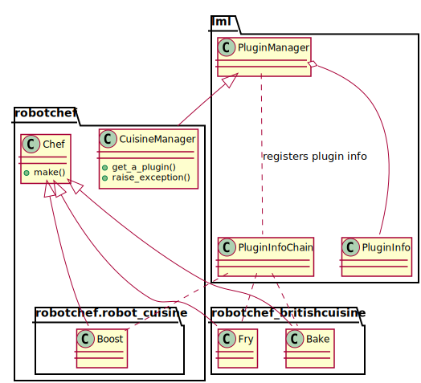

Robot Chef distributed in multiple packages
================================================================================

In previous chapter, **Robot Chef** was written using lml but in a single
package and its plugins are loaded immediately. In this chapter, we will
decouple the plugin and the main package using lml. And we will
demonstrates the changes needed to plugin them back with the main package.

Demo
--------------------------------------------------------------------------------

Please navigate to
`lml/examples <https://github.com/chfw/lml/tree/master/examples>`_,
you would find robotchef and its packages. Do the following::

    $ cd robotchef
    $ python setup.py install

The main command line interface module does simply this::

    $ robotchef "Portable Battery"
    I can cook Portable Battery for robots

Although it does not understand all the cuisines in the world as you see
as below::

    $ robotchef "Jacket Potato"
    I do not know how to cook Jacket Potato

it starts to understand it once you install Chinese cuisine package to complement
its knowledge::

    $ cd robotchef_britishcuisine
    $ python setup.py install

And then type in the following::

     $ robotchef "Fish and Chips"
     I can fry Fish and Chips

The more cuisine packages you install, the more dishes it understands. Here
is the loading sequence:

.. image:: _static/images/loading_sequence.svg

Decoupling the plugins with the main package
--------------------------------------------------------------------------------

In order to demonstrate the capabilities of lml, `Boost` class is singled out and
placed into an internal module **robotchef.robot_cuisine**. `Fry` and `Bake` are
relocated to **robotchef_britishcuisine** package, which is separately installable.
:ref:`built-in` and :ref:`standalone-plugin` will explain how to *glue* them up.

After the separation, in order to piece all together, a special function
:meth:`lml.loader.scan_plugins` needs to be called before the plugins are used.

.. literalinclude:: ../../examples/robotchef/robotchef/main.py
   :diff: ../../examples/robotchef_allinone_lml/robotchef_allinone_lml/main.py

What's more, :meth:`lml.loader.scan_plugins` search through all
installed python modules and register plugin modules that has prefix "robotchef_".

The second parameter of scan_plugins is to inform pyinstaller about the
package path if your package is to be packaged up using pyinstaller.
`white_list` lists the built-ins  packages.

Once scan_plugins is executed, all 'cuisine' plugins in your python path, including
the built-in ones will be discovered and will be collected by
:class:`~lml.plugin.PluginInfoChain` in a dictionary for
:meth:`~lml.PluginManager.get_a_plugin` to look up.

Plugin management
-----------------------

As you see in the class relationship diagram, There has not been any changes for
`CuisineManager` which inherits from `:class:lml.PluginManager` and manages
**cuisine** plugins. Please read the discussion in
:ref:`previous chapter <cuisine_manager>`. Let us look at the plugins.

.. _builtin-plugin:

Built-in plugin
++++++++++++++++++++++++++++++++++++++++++++++++++++++++++++++++++++++++++++++++

`Boost` plugin has been placed in a submodule, **robotchef.robot_cuisine**. Let
us see how it was done. The *magic* lies in  robot_cuisine module's __init__.py

.. literalinclude:: ../../examples/robotchef/robotchef/robot_cuisine/__init__.py
  :language: python

A unnamed instance of :class:`lml.plugin.PluginInfoChain` registers the meta
data internally with `CuisineManager`. `__name__` variable
refers to the module name, and in this case it equals 'robotchef.robot_cuisine'.
It is used to form the absolute import path for `Boost` class.

First parameter **cuisine** indicates that `electrify.Boost` is a **cuisine** plugin.
**lml** will associate it with `CuisineManager`. It is why CuisineMananger
has initialized as 'cuisine'. The second parameter is used
the absolute import path 'robotchef.robot_cuisine.electricity.Boost'. The third
parameter `tags` are the dictionary keys to look up class `Boost`.

Here is a warning: to achieve lazy loading as promised by **lml**, you shall avoid
heavy duty loading in __init__.py.
this design principle: **not to import any un-necessary modules in your plugin
module's __init__.py**.

That's all you need to write a built-in plugin.

.. _standaline-plugin:

Standalone plugin
++++++++++++++++++++++++++++++++++++++++++++++++++++++++++++++++++++++++++++++++

Before we go to examine the source code of **robotchef_britishcuisine**,
please let me dictate that the standalone plugins shall respect the package
prefix, which is set by the main package. In this case, the plugin packages
shall start with 'robotchef_'. Hence for British Cuisine, it is named as
'robotchef_britishcuisine'.

Now let us have look at the module's __init__.py, you would find similar the
plugin declaration code as in the following. But nothing else.

.. literalinclude:: ../../examples/robotchef_britishcuisine/robotchef_britishcuisine/__init__.py
  :language: python
  :linenos:

Because we have relocated `Fry` and `Bake` in this package,
the instance of :class:`~lml.plugin.PluginInfoChain` issues two chained call
:meth:`~lml.plugin.PluginInfoChain.add_a_plugin` but with corresponding
parameters.

.. note::
   In your plugin package, you can add as many plugin class as you need. And
   the tags can be as long as you deem necessary.

Let me wrap up this section. All you will need to do, in order to make a
standalone plugin, is to provide a package installer(setup.py and other related
package files) for a built-in plugin.

The end
--------------------------------------------------------------------------------

That is all you need to make your main component to start using component based
approach to expand its functionalities. Here is the takeaway for you:

#. :class:`lml.plugin.PluginManager` is just another factory pattern that hides
   the complexity away.
#. You will need to call :meth:`lml.loader.scan_plugins` in your __init__.py or
   where appropriate before your factory class is called.

More standalone plugins
++++++++++++++++++++++++++++++++++++++++++++++++++++++++++++++++++++++++++++++++

You are left to install robotchef_chinesecuisine and robotchef_cook yourself and
explore their functionalities.

How to ask robotchef to forget British cuisine?
++++++++++++++++++++++++++++++++++++++++++++++++++++++++++++++++++++++++++++++++

The management of standalone plugins are left in the hands of the user. To prevent
robotchef from finding British cuisine, you can use pip to uninstall it, like this::

    $ pip uninstall robotchef_britishcuisine
